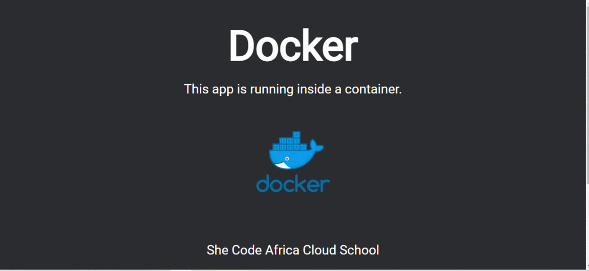

# She Code Africa Cloud School

## Week 3: Docker

**Task 1:** Write a Dockerfile (for any sample application), build an image from it, and then launch a container from that image.

**Task 2:** Write a docker-compose file for the same application, then build and run the application.

---

### Sample Node App

---

### Resources

[Node Official Image](https://hub.docker.com/_/node)
